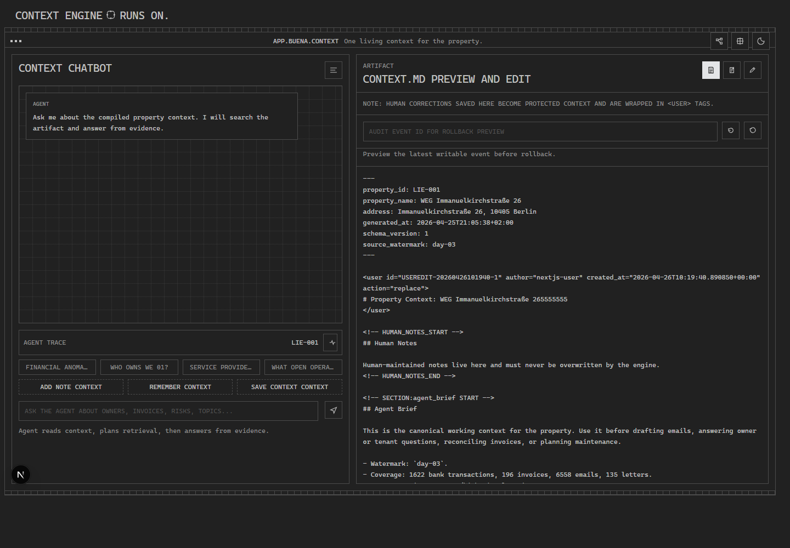
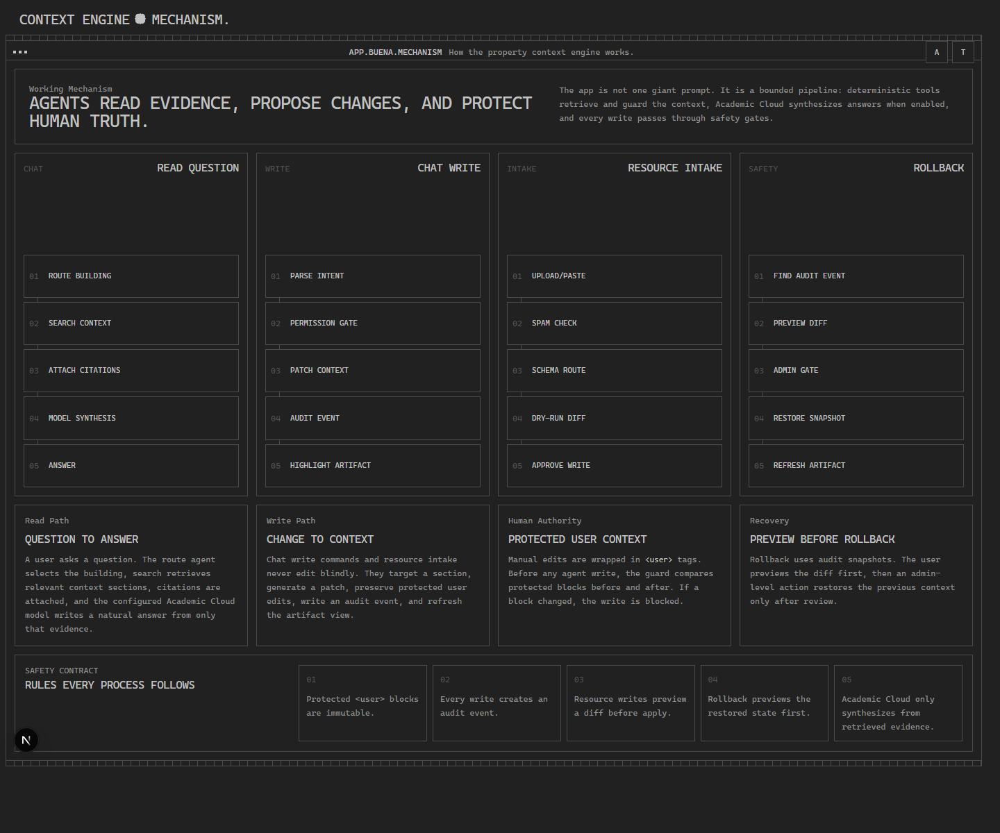

# BerlinHackBuena

Buena Context Engine is a hackathon prototype for turning scattered property-management data into one durable, editable context artifact.

It ingests bank rows, invoices, emails, letters, master data, and incremental updates, then writes a canonical `context.md` for one property. The dashboard lets you run the pipeline, ask questions, stage new resources, and safely edit the compiled artifact with protected `<user>` blocks.

## Screenshots

### Main Context Workspace



### Working Mechanism Page



## Demo

Use the guided demo script in [docs/DEMO.md](docs/DEMO.md).

Quick demo flow:

1. Open `http://127.0.0.1:3000`.
2. Ask `Who owns WE 01?`.
3. Open the agent trace and show `model_synthesis`.
4. Ask `Add note: Heating contractor confirmed a follow-up appointment for 2026-04-27.`.
5. Show the highlighted context update in the artifact.
6. Open `/mechanism` to explain the pipeline visually.

## What Works Now

- Compile a base property context from `data/`.
- Apply incremental day folders as patch updates.
- Replay all deltas.
- Ask natural-language questions against the compiled context.
- Use Academic Cloud or Gemini for AI synthesis after deterministic evidence retrieval.
- Edit `context.md` directly from the frontend.
- Preserve human edits inside `<user>...</user>` blocks during future patches.
- Add pasted/file resources from the frontend and preview an agent write before applying it.
- Ask questions through a schema-guided chat agent with local frontend threads.
- Reject obvious spam or invalid resources without changing `context.md`.
- Write accepted resources into the correct context section with protected `AGENT_INTAKE` blocks.
- See readiness signals for context state, patch count, protected user edits, staged resources, and AI configuration.
- Return cited agent answers and visual trace data for route, retrieval, model synthesis, citation, and write steps.
- Auto-route agent requests to the most relevant building context when no building is selected.
- Roll back audited writes with an admin-only endpoint.
- Enforce `viewer`, `editor`, `approver`, and `admin` roles for agent actions.

## Repository Structure

```text
.
|-- context_engine/        # Python package, CLI, LangGraph workflow, web app
|-- app/                   # FastAPI bounded agent supervisor API
|-- data/                  # Source data: bank, emails, invoices, letters, master data, deltas
|-- docs/                  # Screenshots, deployment notes, and demo script
|-- frontend/              # Next.js dynamic frontend
|-- outputs/               # Generated local artifacts, ignored by git
|-- schemas/               # Markdown schemas that guide agentic validation and writes
|-- tests/                 # Unit and web API tests
|-- IMPLEMENTATION.md      # Implementation notes
|-- PROJECT_VISUAL_GUIDE.html # Standalone visual guide for demos and onboarding
|-- PROBLEM_STATEMENT.md   # Challenge/problem description
|-- prompt.md              # Manual-edit feature implementation prompt
|-- requirements.txt       # Python dependencies
`-- pyproject.toml
```

## Setup

Install dependencies:

```powershell
python -m pip install -r requirements.txt
```

Copy `.env.example` to `.env` and fill in your own key:

```powershell
Copy-Item .env.example .env
```

Example `.env` values:

```env
AI_PROVIDER=academiccloud
ACADEMIC_CLOUD_API_KEY=your_academic_cloud_key_here
ACADEMIC_CLOUD_BASE_URL=https://chat-ai.academiccloud.de/v1
ACADEMIC_CLOUD_MODEL=llama-3.3-70b-instruct
```

AI is optional. Without a key, the engine still runs deterministically.

Security note: `.env` is ignored by git. Do not commit real API keys.

## Run The Next.js App

Start the Python API:

```powershell
python -m context_engine serve --host 127.0.0.1 --port 8765
```

In a second terminal, start the Next.js frontend:

```powershell
cd frontend
npm install
npm run dev
```

Open:

```text
http://127.0.0.1:3000
```

The Next.js app proxies `/api/*` to `http://127.0.0.1:8765` by default. To point it at another backend:

```powershell
$env:NEXT_PUBLIC_API_BASE_URL="http://127.0.0.1:8765"
npm run dev
```

Recommended manual flow:

1. Start the Python API and Next.js frontend.
2. Ask a question in the chatbot.
3. Open the compact trace icon and confirm `model_synthesis` appears for AI answers.
4. Click the resource icon in the top-right chrome and paste a sample email or text.
5. Click the preview icon, review the side-by-side diff, then apply the approved write.
6. In the artifact column, click the edit icon.
7. Change a line in `context.md`.
8. Click the save icon to save with `<user>` tags.
9. Confirm the saved artifact contains protected `<user>...</user>` blocks.
10. Open `/mechanism` from the mechanism icon to explain the system visually.

The Python server is now API-only. The frontend lives in the dynamic Next.js app at `http://127.0.0.1:3000`.

## Live Deployment

See [docs/DEPLOYMENT.md](docs/DEPLOYMENT.md) for free hosting options.

Recommended hackathon split:

- Backend: Render free web service
- Frontend: Vercel free project

Keep API keys only on the backend. The frontend should only receive:

```env
NEXT_PUBLIC_API_BASE_URL=https://your-backend-url
```

## CLI Usage

Compile the base context:

```powershell
python -m context_engine bootstrap --source data --output outputs
```

Apply one incremental day:

```powershell
python -m context_engine apply-delta --source data --output outputs --delta data/incremental/day-01
```

Replay all incremental days:

```powershell
python -m context_engine replay-deltas --source data --output outputs
```

Ask from the compiled context:

```powershell
python -m context_engine ask --context outputs/properties/LIE-001/context.md --question "What unresolved financial anomalies exist?"
```

Use AI synthesis:

```powershell
python -m context_engine ask --context outputs/properties/LIE-001/context.md --question "What should a property manager review first today?" --use-ai
```

Show current status:

```powershell
python -m context_engine status --output outputs
```

Validate staged resources and write accepted evidence into `context.md`:

```powershell
python -m context_engine process-intake --output outputs
```

Status includes:

- Watermark
- Context existence
- Latest patch
- Patch count
- Protected user edit count
- Staged resource count
- AI configured state
- Extracted metrics

## Agentic Intake Schemas

The intake agent reads markdown schemas from `schemas/`:

- `RESOURCE_VALIDATION_SCHEMA.md`: decides whether a staged resource is valid or spam.
- `CONTEXT_WRITE_SCHEMA.md`: maps valid resources to allowed `context.md` sections.
- `INGESTION_PROCESS_SCHEMA.md`: defines the bounded end-to-end process.
- `PARSER_SCHEMA.md`: defines source families, filename patterns, entity patterns, and email classification/score rules.
- `RENDER_SCHEMA.md`: defines `context.md` section order, anchors, titles, and renderer tool names.
- `PATCH_SCHEMA.md`: defines patchable sections and locked block patterns.
- `CHAT_AGENT_SCHEMA.md`: defines the safe read-only agent contract for chatbot answers.

This keeps the feature agentic but controlled. The agent can validate, route, summarize, and write accepted resources, but it cannot edit arbitrary files or remove protected user context.

The parser, renderer, and patcher still use deterministic Python executors for safety and repeatability, but their task contracts now come from markdown schemas instead of being buried only in code.

## Agent Supervisor API

The `app/` FastAPI layer exposes a bounded agent API:

- `GET /api/v1/agents/tools`: list the registered tools agents may call.
- `POST /api/v1/agents/chat`: route to a building, retrieve evidence, optionally synthesize with Academic Cloud/Gemini, answer with citations, and return a visual `trace.nodes` pipeline.
- `POST /api/v1/agents/intake`: validate resource text, reject spam/noise, and dry-run or write a context update.
- `POST /api/v1/agents/patch`: dry-run or apply a guarded patch.
- `POST /api/v1/agents/rollback`: restore the before-snapshot from an audited write event.
- `GET /api/v1/agents/audit/{building_id}`: inspect the audit log for a building.

Roles are passed with `X-Agent-Role`:

- `viewer`: chat/read only.
- `editor`: dry-run patch and intake.
- `approver`: write patch and intake.
- `admin`: rollback plus all lower actions.

The Next.js chat tries `/api/v1/agents/chat` first and renders the returned trace visually. If that API is unavailable, it falls back to legacy `/api/ask` and renders a smaller trace from legacy metadata.

Useful chat examples:

```text
Who owns WE 01?
```

```text
What should a property manager review first today?
```

```text
Add note: Heating contractor confirmed a follow-up appointment for 2026-04-27.
```

```text
Remember: WE 01 owner asked for a payment status review after the next bank import.
```

## Testing

Run:

```powershell
python -m pytest -q -p no:cacheprovider
```

Validate the Next.js frontend:

```powershell
cd frontend
npm run typecheck
npm run build
```

The tests cover:

- Status before generation
- Bootstrap and ask API flow
- Direct artifact editing with protected `<user>` tags
- Preservation of user edits after delta patching
- Resource intake staging
- Agent citations and visual trace nodes
- Academic Cloud/Gemini model-synthesis trace when `use_ai=true`
- Multi-building auto-routing
- Role-based write and rollback permissions
- Rollback from audited write snapshots

## Current Limitations

- Resource intake now writes accepted staged text into `context.md`; deeper native parsing for PDFs/binary files remains a future phase.
- PDF extraction is represented by the existing sample parsers and source data assumptions.
- The app currently targets property `LIE-001`.
- Human edits are intentionally visible in `context.md` so AI and future ingestion can treat them as authoritative.

## Development Notes

- Do not commit `.env`.
- Do not commit generated `outputs/`.
- Keep protected `<user>` blocks intact when changing patch logic.
- Prefer deterministic behavior first; AI should advise or summarize, not become the source of truth.
